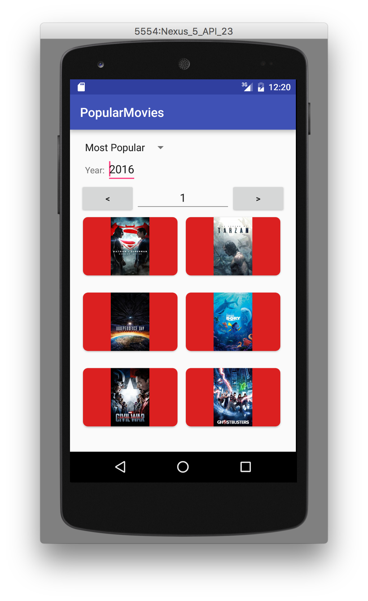
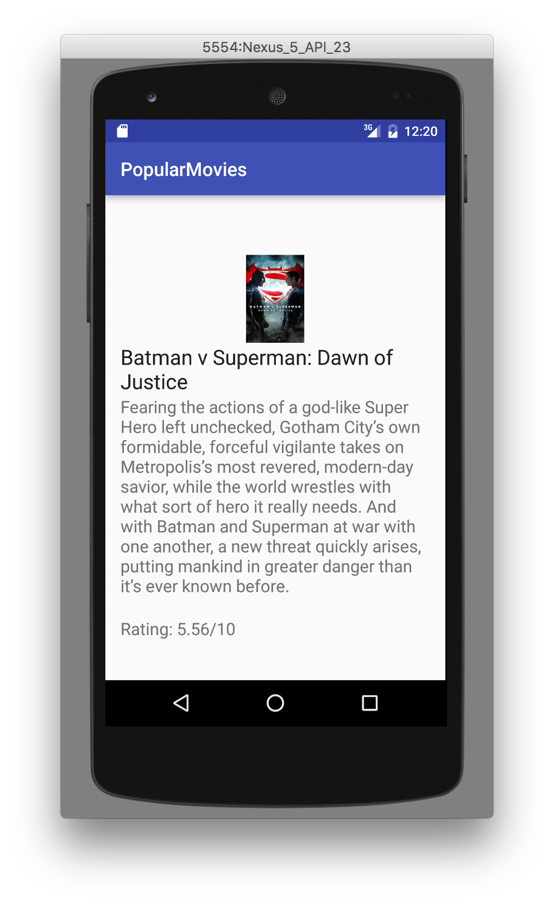
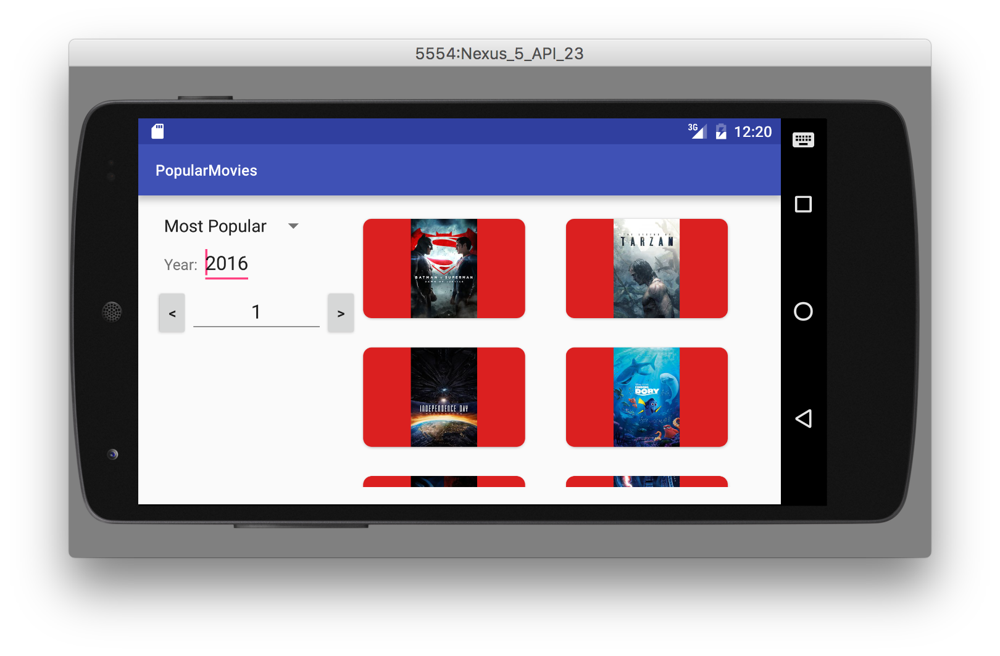
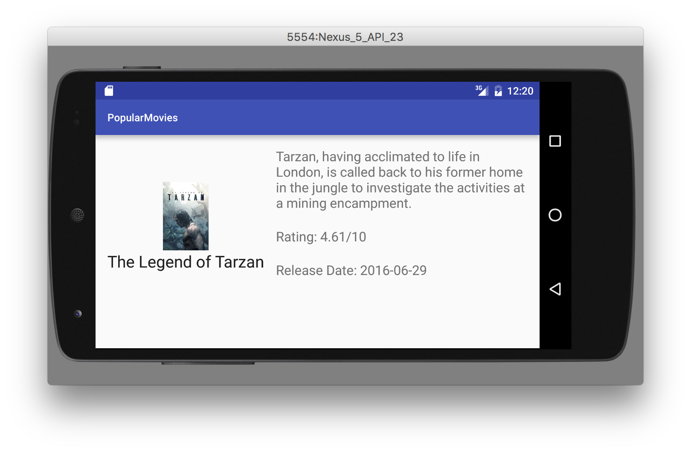

# Udacity-Project-1
##Popular Movies

###Overview:

Popular Movies features [The Movie DB's API](https://www.themoviedb.org/).  The app displays a list of movies sorted by popularity or rating.  I also added the feature to query for said categories by year.  The app was formatted to work in both portrait and landscape mode.

##Screenshots:
 
 
 
 

